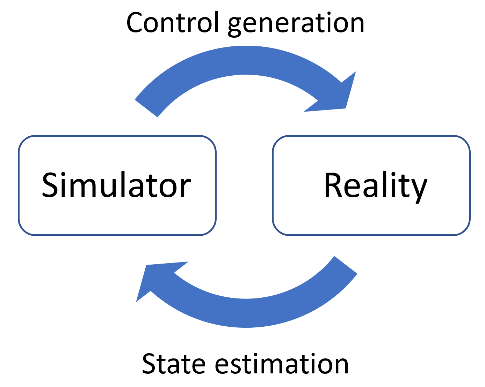

I am investigating how differentiable simulators can help us reduce the simulation-reality gap. The end-to-end differentiability of such simulators allows us to efficiently optimize their parameters, which means the physics engine can be incorporated into learning-based architectures. By augmenting the original physics engine with neural networks, even unmodeled effects can be captured by such learning-based simulator (see [NeuralSim](https://eric-heiden.com/publication/2021-neuralsim-icra/)).
